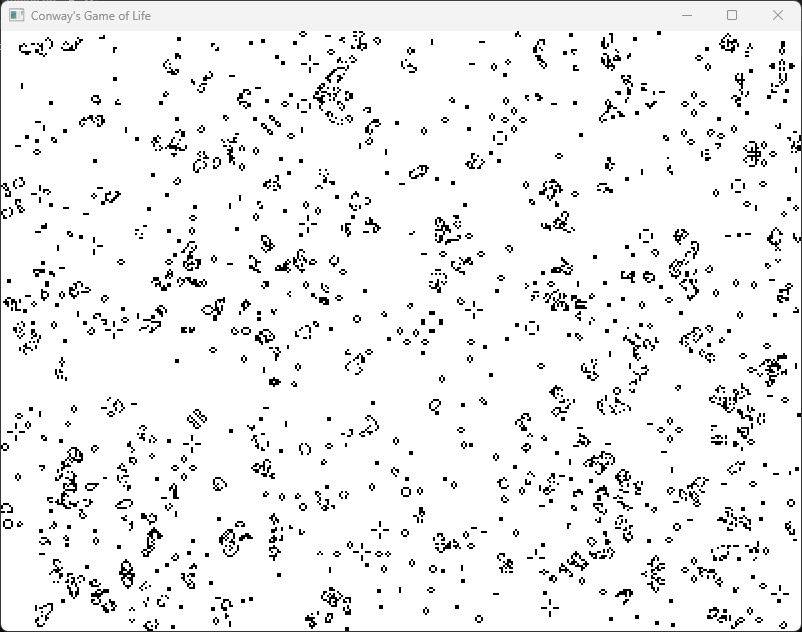
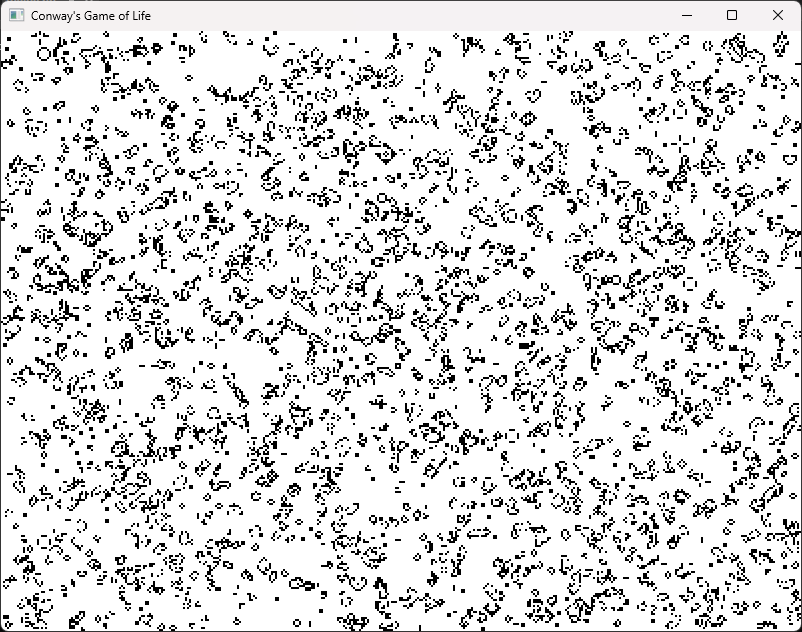

# Conway's Game of Life in C++
This is my implementation of the popular cellular automaton known as 'Conway's Game of Life' in C++.

## Screenshots

    
    

## General Info
This simulation starts by using a set number of random alive cells on a set grid. These values can be changed in the 'main' file. 

## External Libraries
* SFML (Simple and Fast Multimedia Library)
